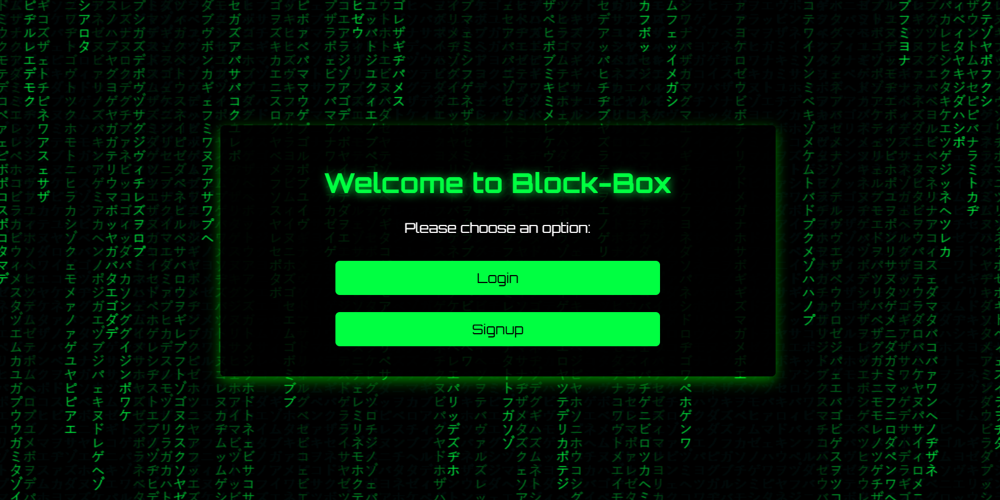
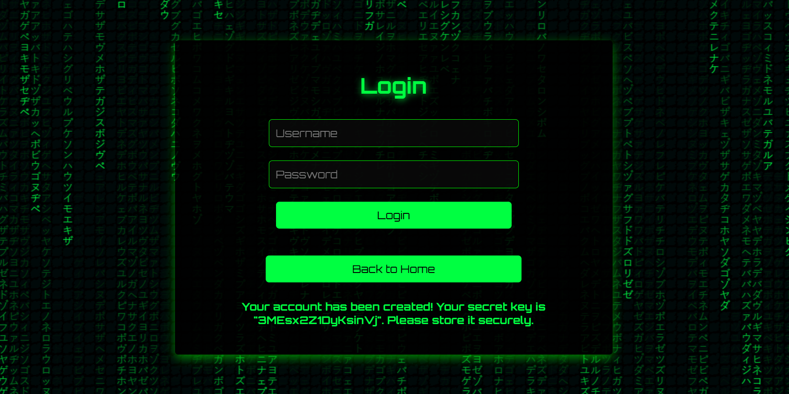
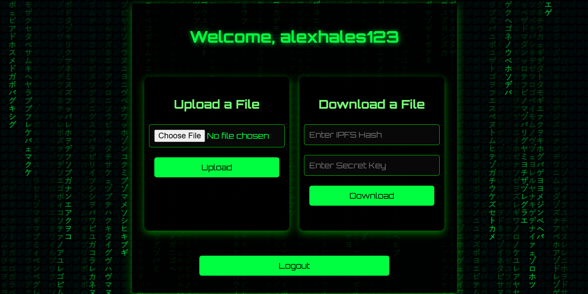

# Block-Box

Block-Box is a secure, web-based file storage application that prioritizes user privacy and data integrity. It features a robust authentication system where each registered user is issued a unique secret key, which also functions as a second factor of authentication during file downloads. Files are encrypted locally using symmetric encryption (Fernet) before being uploaded to the InterPlanetary File System (IPFS), leveraging decentralized storage for improved reliability and resistance to tampering. To maintain a verifiable record of all uploads, the platform stores file metadata—such as the IPFS hash and filename—on a custom blockchain, creating an immutable audit trail. Users can later retrieve and decrypt their files securely using their secret key and the associated IPFS hash.

## Features

- **User Registration & Login:** Implements a simple in-memory authentication system for managing user access.
- **File Encryption:** Files are encrypted locally using Fernet symmetric encryption before upload, ensuring confidentiality.
- **Decentralized Storage:** Encrypted files are uploaded to IPFS, providing tamper-resistant and distributed storage.
- **Blockchain Metadata:** File metadata (such as IPFS hash and filename) is stored on a custom blockchain for integrity and traceability.
- **Personal Secret Key:** Each user receives a unique secret key, which acts as Two-Factor Authentication (2FA) when attempting to download an uploaded file.
- **File Download:** Users can securely download and decrypt their files using the IPFS hash and their secret key.
- **File Size & Type Restrictions:** Only files up to 25 MB and of allowed types (`.txt`, `.pdf`, `.png`, `.jpg`, `.jpeg`) can be uploaded.

## Screenshots

### Login/Signup Page


### Secret Key Generation


### Upload/Download Interface


## Tech Stack

### Backend
- **Python 3.10+** – Core backend logic
- **Flask** – Web framework for routing and session handling
- **cryptography (Fernet)** – Symmetric encryption for files
- **Custom Blockchain** – Stores file metadata (IPFS hash, filename)
- **IPFS Client** – Uploads/retrieves files via local IPFS node

### Frontend
- **HTML5 + Jinja2** – Dynamic page rendering
- **CSS3** – UI styling (`styles.css`)
- **JavaScript** – Matrix Theme

### Storage
- **IPFS** – Decentralized file storage 
- **Local File System** – Temp storage for uploads/downloads

### Security
- **Fernet Encryption** – Local encryption/decryption
- **Flask Sessions** – Manages authenticated user sessions

## Installation

### Prerequisites
- Python 3.10+
- pip (Python package manager)
- IPFS (go-ipfs v0.7.0)

### Steps

1. **Install IPFS:**
   
   **Windows:**
   - Download from: [https://dist.ipfs.tech/go-ipfs/v0.7.0/](https://dist.ipfs.tech/go-ipfs/v0.7.0/)
   - Extract to a directory (e.g., C:\ipfs)
   - Add folder to System PATH via: Start → Environment Variables → Path → Edit → New → Add C:\ipfs
   - To verify installation, run: ```ipfs version```
  
   **Linux/macOS:**
   ```
   wget https://dist.ipfs.tech/go-ipfs/v0.7.0/go-ipfs_v0.7.0_linux-amd64.tar.gz
   tar -xvzf go-ipfs_v0.7.0_linux-amd64.tar.gz
   cd go-ipfs
   sudo bash install.sh
   ipfs version
   ```

2. **Initialize IPFS (intialization required only once):**  <pre>```ipfs init```</pre>

3. **Clone the repository and install dependencies:**
   ```
   git clone https://github.com/AdityaKarun/Block-Box.git
   cd Block-Box
   ```
   
4. **Set up a virtual environment:**
   
   **Windows:**
   ```
   python -m venv venv
   venv\Scripts\activate
   ```

   **Linux/macOS:**
   ```
   python3 -m venv venv
   source venv/bin/activate
   ```
   
5. **Install Python dependencies:** <pre>```pip install -r requirements.txt```</pre>

6. **Start IPFS daemon:** <pre>```ipfs daemon```</pre>
   Keep this terminal open; the daemon must be running whenever you use the app.

7. **Run the Flask application:** <pre>```python app.py```</pre>

8. **To access the application, open your browser and go to:** <pre>```http://localhost:5000```</pre>

## Usage

### 1. Sign Up
- Go to the signup page.
- Enter a username and password.
- You will receive a unique secret key. **Store this key securely**; it is required for file downloads.

### 2. Log In
- Enter your username and password.

### 3. Upload a File
- Select a file to upload (max 25 MB, allowed types: `.txt`, `.pdf`, `.png`, `.jpg`, `.jpeg`).
- The file is encrypted and uploaded to IPFS.
- You receive the IPFS hash for later retrieval.

### 4. Download a File
- Enter the IPFS hash and your secret key.
- If file hash and secret key are valid, the file is downloaded from IPFS, decrypted, and served to you.

## Feedback & Support

If you find any bugs, have feature requests, or want to contribute, feel free to open an issue or submit a pull request. Your feedback helps improve Block-Box!

Thanks for checking out the project!
